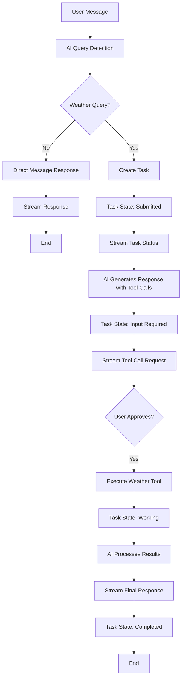

# a2a-it

I am exploring ways to build **Agent Applications**, especially paying attention to **Human-In-The-Loop**.

I built this project to find out how HITL can be implemented with **A2A Protocol**. Generally it is done by sending HITL related info withing `DataPart`.

There are very few examples of A2A servers in the community, which makes it difficult to find examples of A2A servers with HITL features. In particular, the A2A protocol intentionally does not specify information related to tool calling, making it a black box.

Therefore, I don't know if my implementation fully aligns with the original design intent of the protocol. If my implementation is correct, the next step should be to abstract this paradigm into an Extension.

Any feedback is welcome.

## ✨ Features

- 🤖 **AI-Powered Agent**: Uses ZhiPu AI (GLM-4.5) for intelligent conversation and weather query detection
- 🔧 **Tool Calling**: Advanced tool call handling with user approval workflow
- 📡 **Streaming Responses**: Real-time streaming of agent responses and task updates
- 🎯 **Smart Query Detection**: Automatically detects weather-related queries using AI
- 📋 **Task Management**: Complete task lifecycle management (submitted → working → completed)
- 🛠️ **Type Safety**: Full TypeScript support with proper type checking
- ⚡ **Fast Runtime**: Built with Bun for optimal performance
- 🔄 **A2A Compliant**: Fully compliant with the Agent-to-Agent protocol specification

## 🚀 Quick Start

### Prerequisites

- [Bun](https://bun.sh) runtime
- OpenAI API key (for ZhiPu AI integration)

### Installation

```bash
# Clone the repository
git clone <repository-url>
cd a2a-it

# Install dependencies
bun install

# Set up environment variables
export OPENAI_API_KEY="your-openai-api-key-here"
```

### Running the Server

```bash
# Start the weather agent server
bun run s
```

The server will start on `http://localhost:3000` with:

- 🌐 **Agent Card**: `http://localhost:3000/.well-known/agent-card.json`
- 📡 **A2A Endpoints**: Full A2A protocol support
- 📝 **Logs**: Real-time server activity logging

### Testing with Client

```bash
# Run the test client (in a separate terminal)
bun run c
```

This will:

1. Connect to the weather agent
2. Send a weather query ("weather of shenzhen?")
3. Handle tool call approval workflow
4. Stream and display responses

## 🏗️ Architecture

### Server Components

- **`server/index.ts`**: Main server setup with Express and A2A integration
- **`server/ai.ts`**: ZhiPu AI configuration and model setup
- **`server/weather.ts`**: Weather query detection and data simulation
- **`server/util.ts`**: Utility functions for text extraction and logging

### Client Components

- **`client/index.ts`**: A2A client implementation demonstrating:
  - Agent discovery via agent card
  - Streaming message handling
  - Tool call approval workflow
  - Event processing (tasks, status updates, artifacts)

## 🎯 How It Works

### System Architecture Flow



### Workflow Breakdown

#### 1. Query Detection

The agent uses AI to intelligently detect whether a user message is weather-related:

```typescript
// Example: "What's the weather like in Tokyo today?"
// → Detected as weather query → Creates task with tool calling

// Example: "Tell me a joke"
// → Detected as non-weather → Direct response
```

#### 2. **Direct Message Path** 📨

For non-weather queries, the agent responds immediately:

- Uses AI to generate a contextual response
- Streams the response in real-time
- No task creation required

#### 3. **Task-Based Path** 📋

For weather queries, the agent follows a structured workflow:

1. **Task Creation**: Creates an asynchronous task with unique ID
2. **Status Streaming**: Updates task state (`submitted` → `working` → `completed`)
3. **Tool Call Request**: AI requests permission to execute weather tool
4. **User Approval**: Waits for user to approve/reject tool calls
5. **Tool Execution**: Calls weather API with approved parameters
6. **Response Generation**: AI formats weather data into natural language

#### 4. **Streaming Throughout** 📡

The system supports real-time streaming of:

- **Task Status Updates**: `submitted` → `working` → `completed`
- **Artifact Updates**: Incremental text generation
- **Tool Call Events**: Real-time tool execution tracking
- **Direct Messages**: Immediate response streaming

## 📡 A2A Protocol Features

### Agent Card

```json
{
  "name": "Weather Agent",
  "description": "A simple agent that responds with weather messages.",
  "protocolVersion": "0.3.0",
  "capabilities": {
    "streaming": true,
    "pushNotifications": false,
    "stateTransitionHistory": true
  },
  "skills": [{
    "id": "weather",
    "name": "Weather Response",
    "description": "Responds with weather to any message"
  }]
}
```

### Message Types

- **Direct Messages**: Immediate responses for simple queries
- **Task-Based Messages**: Asynchronous processing with tool calling
- **Streaming Events**: Real-time updates during task execution

## 🛠️ Development

### Available Scripts

```bash
# Start server
bun run s

# Run client
bun run c

# Development mode
bun --hot server/index.ts
```

### Project Structure

```bash
a2a-it/
├── server/
│   ├── index.ts      # Main server application
│   ├── ai.ts         # AI model configuration
│   ├── weather.ts    # Weather logic and tool calls
│   └── util.ts       # Utility functions
├── client/
│   └── index.ts      # A2A client implementation
├── package.json
├── tsconfig.json
└── README.md
```

## 🔧 Configuration

### Environment Variables

```bash
# Required: OpenAI API key for ZhiPu AI
export OPENAI_API_KEY="your-api-key-here"

# Optional: Server port (default: 3000)
export PORT=3000
```

### AI Model Configuration

The project uses ZhiPu AI's GLM-4.5 model via OpenAI-compatible API:

- **Model**: `glm-4.5`
- **Endpoint**: `https://open.bigmodel.cn/api/paas/v4/`
- **Features**: Tool calling, streaming, text generation

## 📚 A2A Protocol Reference

This project serves as a comprehensive example of A2A protocol implementation. Key concepts demonstrated:

- **Agent Discovery**: Agent cards for capability advertisement
- **Task Management**: Stateful task processing with lifecycle management
- **Streaming**: Server-Sent Events for real-time updates
- **Tool Calling**: Secure tool execution with user approval
- **Message Exchange**: Structured communication between agents

For detailed A2A protocol documentation, see: [`a2a-reference.md`](./a2a-reference.md)

## 🤝 Contributing

1. Fork the repository
2. Create a feature branch: `git checkout -b feature/your-feature`
3. Make your changes
4. Test thoroughly with both server and client
5. Submit a pull request

## 📄 License

This project is licensed under the MIT License - see the LICENSE file for details.

## 🙏 Acknowledgments

- [A2A Protocol](https://github.com/a2aproject/A2A) - The foundation for agent-to-agent communication
- [ZhiPu AI](https://open.bigmodel.cn/) - AI model provider
- [Bun](https://bun.sh) - Fast JavaScript runtime
- [@a2a-js/sdk](https://www.npmjs.com/package/@a2a-js/sdk) - A2A JavaScript SDK
